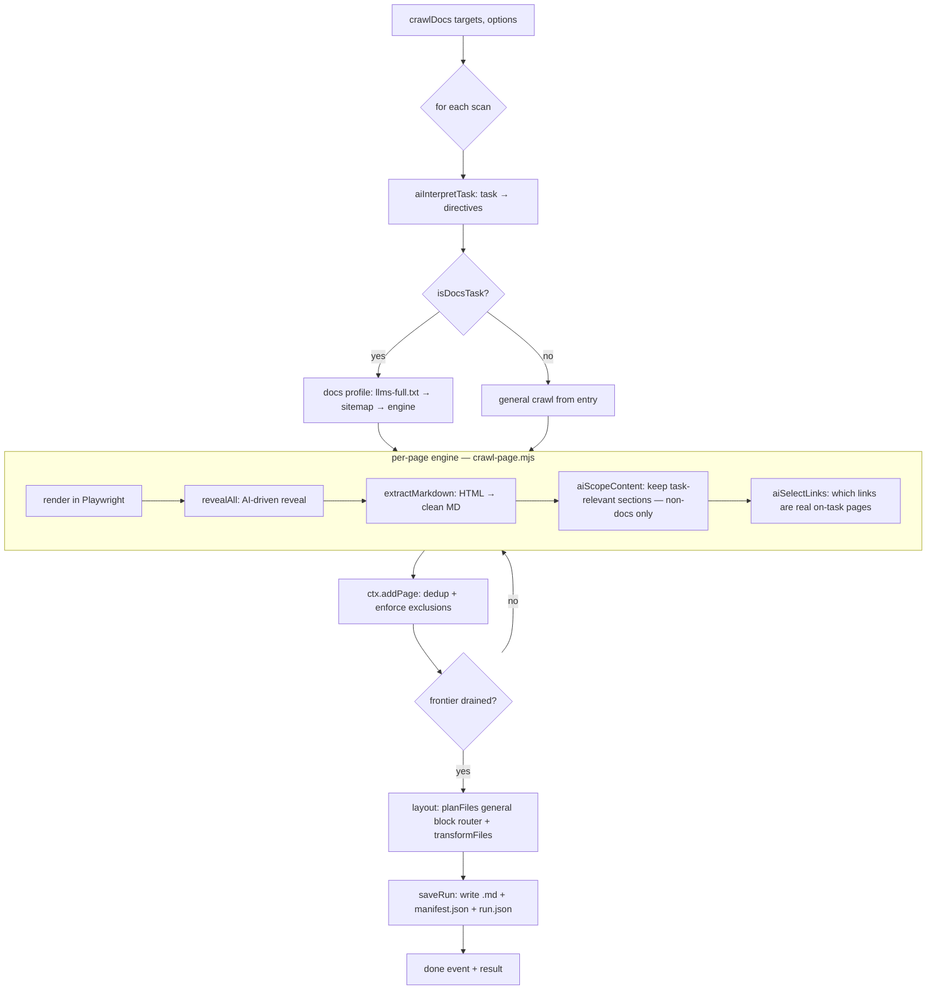

# docdna — How It Works

> A task-driven web crawler that turns any website into clean Markdown, using a
> real browser + a local LLM. This document explains how the system works
> end-to-end as it stands today. For a per-file API reference see
> [`CLAUDE.md`](CLAUDE.md); for the original product spec see
> [`build-spec.md`](build-spec.md).

---

## 1. What it does

You give docdna **one or more URLs** plus a **plain-English task** (e.g. "Extract
all the documentation", "Get the pizza menu", "Put the images in image.md and the
rest in extract.md"). For each site it:

1. **Renders every page in a real headless browser** (Playwright/Chromium) so
   JavaScript-rendered sites and SPAs work — not just static HTML.
2. **Reveals hidden content** — an **AI reads the page's interactive controls
   like a human** and decides which ones hide content (tabs, accordions, "load
   more", variant switches), then clicks them and captures each revealed state.
3. **Discovers pages beyond the DOM** — mines JS/JSON route blobs, sitemaps and
   `llms-full.txt`, and lets the AI decide which links are real, on-task pages.
4. **Stays on-task with AI** — keeps only the sections the task asks for, applies
   faithful element exclusions ("no images"), routes content into the requested
   `.md` files, and (on explicit request) reshapes it ("as a table").

### Guiding principles

- **Precision over speed, always.** Slow is fine; never miss content.
- **Universal, not per-site.** One general AI-driven algorithm for *any* site —
  no per-framework/per-site special cases. Lean on AI for generality.
- **Verbatim by default.** The AI chooses *what to keep* and *which file it lands
  in*; it does **not** rewrite content — except for one opt-in transform the user
  explicitly requests (see §7.6).
- **AI reads the user's task, regex reads nothing about the website.** The few
  deterministic backstops interpret the user's *English instruction* (a reliable
  fallback when the local model hedges); they never hard-code website structure.

---

## 2. Core concepts

| Term | Meaning |
|------|---------|
| **Target** | `{ url, task }`. The unit of work the caller submits. |
| **Scan** | One submitted link's crawl: its own pages, its own dedup, its own output files. A run can hold several scans. |
| **Run** | The container for one invocation: one folder on disk with a subfolder per scan, plus `manifest.json` and `run.json`. |
| **Task** | The natural-language instruction. Interpreted once per scan into structured **directives** (§7.1). |
| **Page** | A crawled+extracted page: `{ url, task, title, markdown, meta }`. |
| **Event** | A streamed progress object (`site`, `page`, `action`, `extracted`, `progress`, `warn`, `saved`, `done`, …). |

---

## 3. The pipeline at a glance



Everything outside this core (the CLI, the Web UI, the sibling `refdna` project)
is just a **consumer** of `crawlDocs`. No crawling logic lives outside the core.

---

## 4. Entry points

All three faces call the same core, [`crawlDocs`](src/index.mjs):

- **CLI** — [`bin/cli.mjs`](bin/cli.mjs). `docdna <url> --task "..."`, plus
  `serve` (Web UI) and `runs` (cache management). Renders the event stream to the
  terminal.
- **Web UI** — [`ui/server.mjs`](ui/server.mjs) + [`ui/index.html`](ui/index.html).
  A `node:http` server with Server-Sent Events for live progress and a small REST
  surface over the runs cache.
- **Library** — `import { crawlDocs } from 'docdna'`. Returns a `run` object that
  is async-iterable (events), exposes `run.result` (a Promise), and `run.stop()`.

```js
const run = crawlDocs(
  [{ url: 'https://example.com', task: 'Extract the pricing as a table' }],
  { model: 'qwen3-coder:30b', browser: 'auto' },
);
for await (const ev of run) console.log(ev.type);
const result = await run.result;   // { scans, stats, warnings, run }
```

---

## 5. Orchestration ([`src/index.mjs`](src/index.mjs))

`crawlDocs` builds one **scan** per target and runs them in sequence. For each
scan it:

1. Emits a `site` event.
2. **Interprets the task once** → `ctx.directives` (cached per task string). See §7.1.
3. Chooses a strategy:
   - `isDocsTask(task)` (matches *documentation / docs / api reference*) →
     **docs profile** ([`src/profiles/docs.mjs`](src/profiles/docs.mjs)).
   - otherwise → **general crawl** (`runGeneralCrawl`).
4. After the frontier drains, **plans the output files** (§8) and **saves the run**.

**`ctx`** is the shared context passed everywhere. It carries `options`, the
active scan, the interpreted `directives`, progress counters, and helper methods:
`emit`, `shouldStop`, `beginScan`, `setTotal`, `markProcessed`, `addPage`,
`runEngine`.

### Frontier & concurrency (`runGeneralCrawl`)

A bounded worker pool (default `concurrency: 4`) drains a URL frontier:

- Each URL is rendered + revealed in its **own browser context**, so pages crawl
  in parallel.
- Discovered links are normalized, scoped (`inScope` + optional `scopePrefix` +
  `include`/`exclude`), de-duplicated, and enqueued.
- **Bootstrap recovery:** if the entry yields no pages (a 404 section root or an
  SPA with no static links), it discovers from the site root once and follows its
  navigation.
- Progress = *work processed* (not pages kept), so the bar always reaches 100%
  even when pages are deduped or empty.

### Dedup & exclusion enforcement (`ctx.addPage`)

Every page from **every source** (llms-full, sitemap, engine, static fallback)
funnels through `addPage`, which is the single chokepoint that:

1. **Enforces the scan's element exclusions** (e.g. "no images") via
   `applyExclusions` — *before* hashing, so dedup sees what the output will.
2. **De-duplicates** by a content signature (links/URLs/whitespace stripped, then
   SHA-1) so the same page reached via throwaway query params collapses.
3. Records the page and emits an `extracted` event.

---

## 6. The discovery & reveal engine

This is the per-page heart of the crawler, in [`src/engine/`](src/engine/).

### 6.1 Render ([`crawl-page.mjs`](src/engine/crawl-page.mjs))

Opens a fresh Playwright page, navigates (`domcontentloaded`), waits for network
idle and for a client-rendered app to actually paint real content, then hands off
to the reveal pass. Popups are recorded and closed. If a browser can't launch it
degrades to a **static fallback** (plain fetch + extraction; emits a warning that
completeness isn't guaranteed).

### 6.2 Perceive ([`perceive.mjs`](src/engine/perceive.mjs))

Runs in the page and returns a structured snapshot of the **main content area**
(densest text container, with site chrome — nav/header/footer/sidebars —
excluded). It produces:

- **Candidate controls** — casts a *wide* net over anything interactive (buttons,
  `[role]`, `[aria-*]`, `[onclick]`, `summary`/`details`, elements with a click
  listener caught by the sniffer injected in [`browser.mjs`](src/lib/browser.mjs),
  `cursor:pointer`, tab/accordion-ish classes). Each candidate carries metadata
  for the AI: `kind` (tab/expander/loadmore/control), `label`, `cls`, nearest
  **heading context**, and a `heuristic` flag (the fallback verdict). Only
  universally-non-content actions (copy/share/print/theme) are hard-filtered out.
- **Links** — *every* destination on the page (nav/footer included), verbatim. No
  URL-shape assumptions; the AI decides which are real pages.
- **Routes** — paths mined from inline scripts / `__NEXT_DATA__` / JSON blobs
  (pages that exist "in the code" but not the DOM).
- **Consent buttons** — for one-time overlay dismissal.

### 6.3 Reveal ([`reveal.mjs`](src/engine/reveal.mjs)) — **AI-driven**

The loop that exhaustively surfaces hidden content:

1. Dismiss cookie/consent overlays once; capture the **baseline** state.
2. Each pass: perceive → collect links/routes → **`aiSelectRevealers` triages the
   candidates** (§7.4): the model reads each control like a human and decides
   which actually hide content. Verdicts are **cached per control signature**;
   controls that only appear *after* a reveal are triaged in the next pass —
   batched waves, **not** a per-click model loop.
3. Click the next approved, un-actioned control:
   - **tab / expander** → click, capture the new state (tagged with the tab label
     so mutually-exclusive variants are all kept).
   - **load more** → click repeatedly until it stops yielding content.
   - a click that navigates → recorded as a discovered link, not a reveal.
4. When no approved controls remain, **scroll** to pull in lazy content, then stop.
5. **`BlockAccumulator`** (in [`extract.mjs`](src/extract.mjs)) accumulates the
   *new* Markdown blocks from each state, de-duplicated by a normalized SHA-1 hash,
   in capture order.

**Reliability:** if the model is unavailable, reveal falls back to the
per-candidate `heuristic` flag, so coverage never drops below the old
selector-based behaviour. A per-page **action budget** (`maxActions`) bounds it.

### 6.4 Extract & clean ([`extract.mjs`](src/extract.mjs))

Converts an HTML state to clean Markdown:

- Picks the densest main-content node; strips chrome (nav/aside/footer, cookie
  banners, edit-this-page toolbars, carbon ads, permalink anchors…).
- **Drops data-URI / inline-SVG images** (``):
  these are decorative encoded blobs that carry no readable text and shatter into
  garbage Markdown. Real `http(s)` images are kept. `stripSvgNoise` is a final
  safety net for SVG markup that leaks as text.
- Converts with Turndown (fenced code blocks with language hints + GFM tables),
  absolutizes links/images, and strips in-article toolbar phrases.

---

## 7. The AI judgment layer ([`src/engine/decide.mjs`](src/engine/decide.mjs))

All prompts to the local Ollama model live here. Each function is verbatim-safe
and **completeness-biased** (when unsure, keep / follow / reveal). Every call
degrades gracefully on failure.

### 7.1 `aiInterpretTask` — task → directives

Called once per scan. Turns the plain-English task into:

```js
{
  exclude:   { images: bool, links: bool },     // drop these element types
  transform: null | { shape: string },          // opt-in output reshape
}
```

It deliberately does **not** decide file layout — that's open-ended ("the task
may be infinite"), so it's judged against the content by the general block router
(§7.5), not pre-enumerated into directive types here. The model is the primary
interpreter; **narrow deterministic backstops** make the common phrasings robust
even if the model hedges. Key rules:

- **Exclusion** ("no images", "without links") → `exclude.*`. Detected by the AI
  *and* a regex requiring a negation verb near the noun (so "extract the images"
  never matches).
- **Keep-bias:** excluding loses content, so an explicit exclusion verb always
  wins, but a bare AI "exclude" is ignored when the task is clearly doing file
  layout (a `.md` name, "separate", "own file", "with their…") — there the content
  is being *filed*, not removed.
- **Mention-gate:** never exclude a noun the task never named (kills model
  hallucinations like flagging links on an images-only task).

### 7.2 `aiScopeContent` — keep only task-relevant sections

For **non-documentation** tasks, splits the page into heading sections and asks
the model which to keep (dropping nav/footer/cookie/marketing/unrelated). Output
is the **original text** of the kept sections — never rewritten. Empty/uncertain
→ keep everything. (Documentation pages are kept whole.)

### 7.3 `aiSelectLinks` — which links are real, on-task pages

Given every raw destination verbatim, the model recognises real pages (normal
URLs, SPA fragment routes `#/contact`, query routes `?view=pricing`, pagination)
versus same-page anchors and off-task links — **without the algorithm hard-coding
any URL-shape rule**. Cached per href; follows everything on failure.

### 7.4 `aiSelectRevealers` — which controls hide content *(the AI-driven core of #6.3)*

Reads the candidate controls (kind/label/class/heading-context) and returns those
that, when clicked, reveal hidden readable content — rejecting copy/share/theme
toggles, demo widgets (date pickers, sliders), and plain navigation. Returns
chosen signatures, or `null` to signal the reveal loop to use its heuristic
fallback.

### 7.5 The general layout router (how content becomes files) — two steps

Layout is **one general, AI-judged mechanism that replaces all per-case handling**
(separate files, images-with/without-their-text, by category, "X from the rest",
duplicating a subset into a second file). Content is treated as fine-grained
**blocks** (heading, paragraph, image, list, table, code), kept **per page**. It
runs in two steps so it stays reliable no matter how big the crawl is:

1. **`aiLayoutScheme(task)`** — decides the file *plan* from the **task alone**
   (no content, so the prompt is tiny and stable). Returns `{ single }`,
   `{ perPage }`, or `{ files: [{ filename, role, rule }] }` where `role` is:
   - **`match`** — holds specific content described by `rule` (e.g. "images with
     their titles/descriptions").
   - **`all`** — holds *everything* (e.g. "the rest in ext.md but include the
     images anyway").
   - **`complement`** — holds "the rest" = everything the match files didn't take.
2. **`aiRouteBlocks`** — routes **one page at a time** into the `match` files
   (small, reliable prompts). `all`/`complement` files are filled
   **deterministically** by the caller, so they can never be dropped or collapse —
   results merge across pages by canonical filename.

This split is what fixed a real scale failure: a single global routing call
collapsed a 12-page crawl into one file. Block granularity is what lets an image
be separated from — or kept with — its caption; text always stays verbatim, and
completeness is guaranteed (unmatched blocks land in the catch-all or an
`other.md`).

### 7.6 `aiReformat` — opt-in, grounded output transform

The one place verbatim is relaxed, and only when the task explicitly asks for a
shape ("as a table"). It reshapes the *already-extracted* content, **grounded**
(use only the given content, keep every value exact, never invent/drop) and
**self-targeting** (content that doesn't fit the shape is returned unchanged).

---

## 8. Output layout ([`src/lib/layout.mjs`](src/lib/layout.mjs))

After a scan's frontier drains, its kept pages become `.md` files:

```
if no pages → []
else        → planFiles (general block router, §7.5)
              then transformFiles if directives.transform
```

- **`planFiles`** — the single, general layout path. Splits every page into
  **blocks** (`splitBlocks`), tags each (type + `hasImage`), gets the file plan
  from `aiLayoutScheme`, routes each page's blocks with `aiRouteBlocks`, fills
  `all`/`complement` files deterministically, and assembles each file verbatim in
  document order (merged across pages by canonical filename). There is **no**
  separate image-split / category special-case — they're all just routings derived
  from the task (§7.5).
- **`transformFiles`** — applies the opt-in `aiReformat` shape to each file's body
  (front-matter preserved; reshaped files get a `transformed:` marker).

Each output file is `{ filename, title, markdown, bytes, pages: string[] }` with
YAML front-matter recording the task, timestamp and source URLs.

---

## 9. Persistence ([`src/lib/runs.mjs`](src/lib/runs.mjs), [`output.mjs`](src/lib/output.mjs))

Every run is cached automatically under `<project>/.docdna/runs/` (override with
`--cache-dir` / `DOCDNA_CACHE_DIR`). A run folder contains:

```
20260621-160156-aa9498/         # run id: <timestamp>-<rand>
├── 01-example-com/             # one subfolder per scan
│   ├── images.md               # the output .md files
│   ├── content.md
│   └── manifest.json           # this scan's files + metadata
├── manifest.json               # run-level manifest
└── run.json                    # run summary (id, createdAt, pages, scans[…])
```

`runs.mjs` also provides `listRuns`, `getRun`, `readRunFile`, `deleteRun`,
`deleteAllRuns` — used by the CLI `runs` subcommand and the Web UI.

---

## 10. Documentation profile ([`src/profiles/docs.mjs`](src/profiles/docs.mjs))

For documentation tasks, completeness comes first, so it tries tiers in order:

1. **`/llms-full.txt`** — the publisher's own complete export; used **verbatim**,
   no browser.
2. **`/sitemap.xml`** (+ `robots.txt`, sitemap indexes) — an authoritative page
   list used to **seed** the engine frontier (scoped to the docs path).
3. **Otherwise** — the engine crawls from the entry page and discovers as it goes.

Tiers 2–3 still run every page through the full browser-first engine, so dynamic
docs (Firebase per-SDK tabs, SPA nav) are fully revealed. The framework modules
under `profiles/docs/framework/` are **legacy/unused** — the engine is universal.

---

## 11. Configuration (`DEFAULT_OPTIONS`)

| Option | Default | Meaning |
|--------|---------|---------|
| `task` | "Extract the complete documentation." | Default task when none given |
| `model` | `qwen3` | Ollama model. **Note:** install one you have, e.g. `--model qwen3-coder:30b` |
| `ollamaHost` | `127.0.0.1:11434` | Override the Ollama server |
| `browser` | `auto` | `never` \| `auto` \| `always` |
| `concurrency` | `4` | Parallel page renders |
| `maxPages` | `0` | Per-scan page cap (0 = unlimited) |
| `maxActions` | `15` | Per-page reveal action budget |
| `include` / `exclude` | — | Regex URL scope filters |
| `cacheDir` | — | Override the runs-cache root |

**Models:** the engine relies on the model for tool-quality JSON. `qwen3-coder:30b`
is reliable for the reveal/link/layout JSON; very small models are not.

---

## 12. The task model (summary)

A task can do four independent things, all AI-judged:

1. **Scope** — *what to keep* (`aiScopeContent`): "extract all data", "only the
   pricing", value filters like "prices over 100".
2. **Exclude** — *faithful element removal* (`exclude.images/links`): "don't
   include images".
3. **Layout** — *how to file what's kept*, decided by the **general two-step
   router** (`aiLayoutScheme` + `aiRouteBlocks`, §7.5): one file (default) · per
   page · by category · images with or without their captions · "X from the rest" ·
   duplicate a subset into a second file — all as block routings judged from the
   task, not fixed cases.
4. **Transform** — *opt-in output shape* (`aiReformat`): "as a table" — the only
   non-verbatim operation, grounded and self-targeting.

---

## 13. Event stream

Consumers iterate the run for live progress. Event types:

`site` · `strategy` · `discover` · `page` · `action` (click/expand/follow/exclude/
transform/layout) · `extracted` · `progress` · `warn` · `error` · `saved` · `done`.

Each event is stamped with the active `scanId`/`scanIndex` so a UI can route it to
the right link.

---

## 14. Known limitations

- **Local model dependent.** Interpretation/reveal/layout quality tracks the
  chosen Ollama model; the deterministic backstops cover only the common cases.
- **Login / CAPTCHA / canvas-only content** isn't extracted.
- **Static fallback** (no browser) skips the reveal pass — interaction-hidden
  content is missed; a warning is emitted.
- **`maxActions`** can cut a very dense page's reveal short (a `max-actions`
  warning is emitted; raise it for full coverage).
- **Cross-page order** follows crawl/completion order, not a guaranteed site order.

---

## 15. Module map

| Area | Files |
|------|-------|
| Core / API | `src/index.mjs` |
| Per-page engine | `src/engine/crawl-page.mjs`, `reveal.mjs`, `perceive.mjs`, `actions.mjs` |
| AI judgment | `src/engine/decide.mjs` |
| Extraction | `src/extract.mjs` |
| Layout & output | `src/lib/layout.mjs`, `src/lib/output.mjs`, `src/lib/runs.mjs` |
| Browser / fetch | `src/lib/browser.mjs`, `src/lib/fetcher.mjs`, `src/lib/pool.mjs` |
| URL / task utils | `src/lib/url.mjs`, `src/lib/task.mjs` |
| Docs profile | `src/profiles/docs.mjs`, `src/profiles/docs/*` |
| Faces | `bin/cli.mjs`, `ui/server.mjs`, `ui/index.html` |
```
